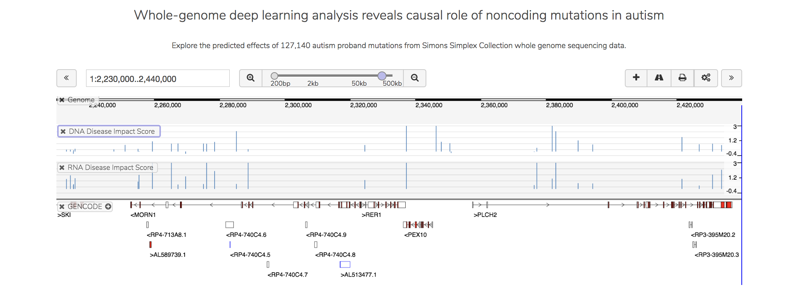

==============
ASD Browser
==============

Introduction
------------

The ASD browser allows exploration of predicted impact (chromatin effects and post-transcriptional RNA-binding protein impact) of de novo noncoding variants in autism probands in the `Simons Simplex Collection <https://www.sfari.org/resource/simons-simplex-collection/>`_.

The variant prediction approach is described in the following manuscript: Zhou J, Park CY, Theesfeld CL, Wong AK, Yuan Y, Scheckel C, Fak JJ, Funk J, Yao K, Tajima Y, Packer A, Darnell RB, Troyanskaya OG. (2019). `Whole-genome deep-learning analysis identifies contribution of noncoding mutations to autism risk <https://www.nature.com/articles/s41588-019-0420-0>`_. Nature Genetics.

Description
-----------

This website provides a user-friendly interactive interface for exploring the sequence-based predicted effects of SSC ASD proband mutations. Both individual molecular-level effects at chromatin (“DNA”) level and RNA-binding protein (“RNA”) level and Disease Impact Scores summarizing molecular level effects are shown. The methodology and analysis are described in the manuscript “Whole-genome deep learning analysis reveals causal role of noncoding mutations in autism”.

The Genome browser can be navigated by entering a genomic interval, a gene name, or interactively through zooming in/out and scrolling. The tracks “DNA Disease Impact Score” and “RNA Disease Impact Score” show mutation disease impact score (DIS) from DNA and RNA models respectively. DIS scores summarize molecular-level biochemical effects at DNA and RNA level into two scores based on regularized logistic regression classifiers trained with HGMD mutations.

Individual molecular-level biochemical effects are shown as a heatmap. The biochemical features are sorted by the magnitude of predicts effects of the center mutation. Each mutation may be clicked to center the genome browser and the heatmap at that mutation, or the heatmap may be dragged to alter the center mutation. The user can select “DNA features” or “RNA features” from the dropdown menu. Mousing over any individual prediction in the heatmap will display details in a tooltip.