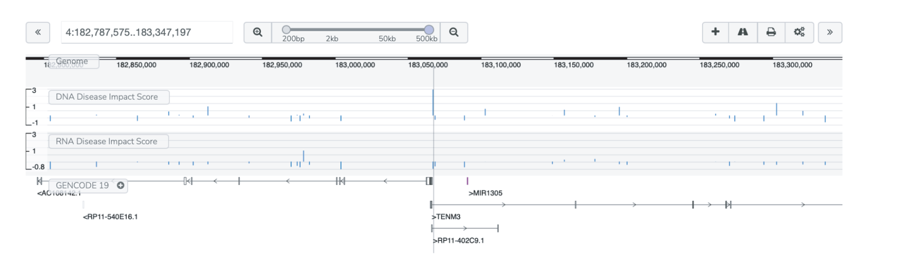
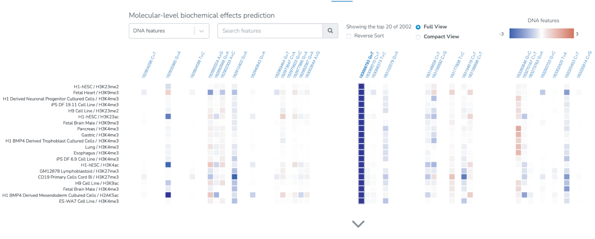

===========================
ASD Genome Browser use case
===========================

**Task: What is the significance of a noncoding autism proband variation observed in the `Simons Simplex Collection <https://www.sfari.org/resource/simons-simplex-collection/>`_?**

* Select the ASD Browser analysis. Input a genomic region of interest. For example, here we view the predicted disease impact of variants in the vicinity of gene TENM3, centered on a predicted high DNA disease impact variant in an intronic region (see the help page for Beluga (DeepSEA) for information on how the DNA disease impact score is computed and the help page for Seqweaver for information on how the RNA disease impact score is computed.

* The heatmap below the genome browser view shows the predicted molecular level impact of each variant. Individual variants can be selected to reorder the feature list for the predicted highest effect features for that variant. For example, for the high predicted DNA disease impact variant at position 183066738 on chromosome 4, multiple chromatin features are predicted to be significantly altered. Users can select whether to view DNA-level or RNA-level effects of the variants.

