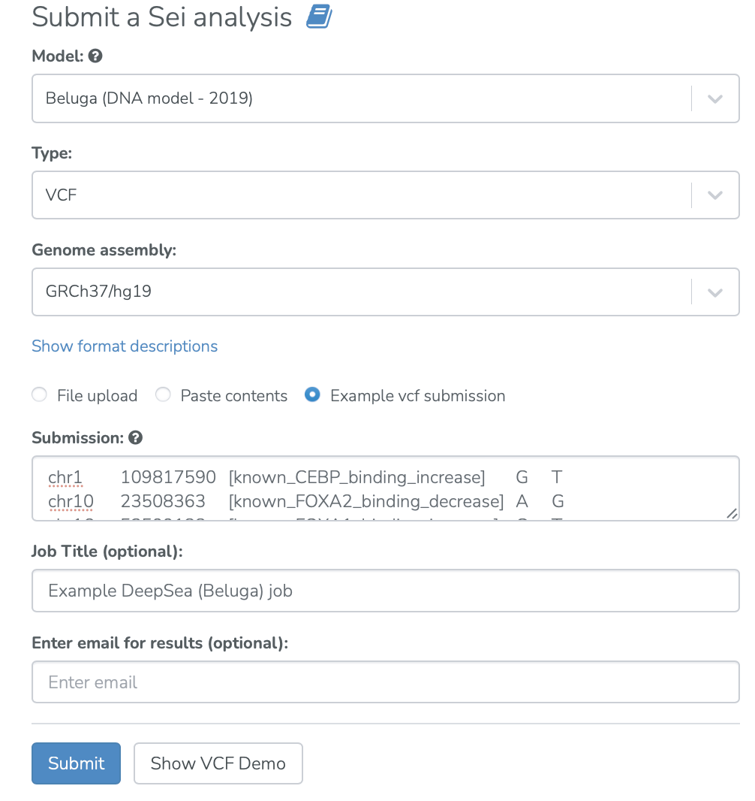
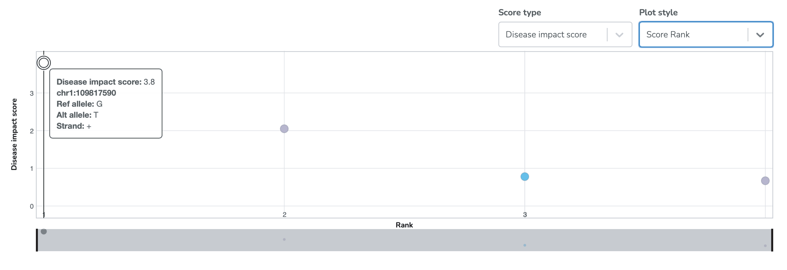
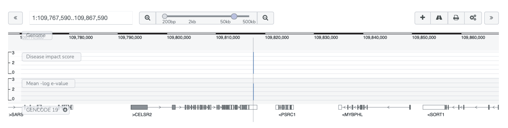
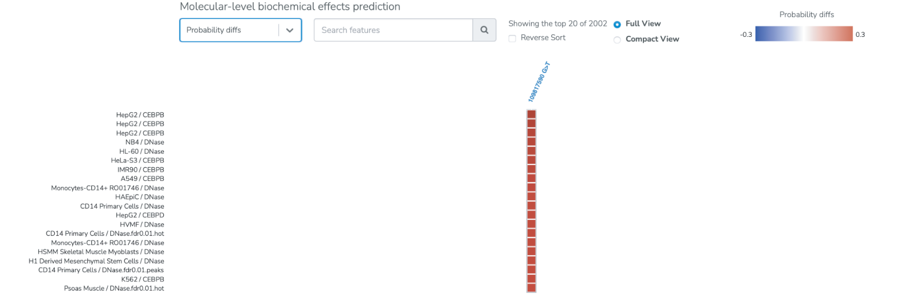
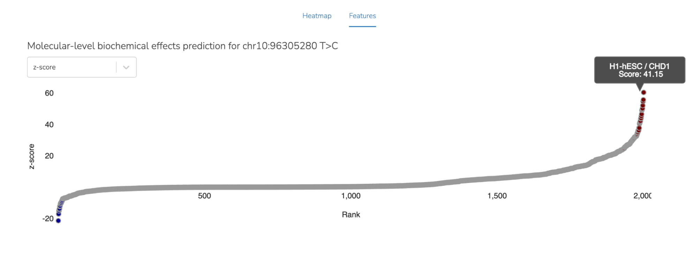

=========================
Beluga (DeepSEA) use case
=========================

**Task: What is the impact of a non-coding variant on the chromatin state of a sequence region?**

* Select the “Beluga” analysis from the main Analyses menu. Input noncoding variants of interest and submit the job.

* View visualizations of the impact of the input variants on the chromatin state of the sequence. Here, the disease impact scores of the query variants are visualized. The disease impact score is calculated by training a logistic regression model that prioritizes likely disease-associated mutations on the basis of the predicted transcriptional or post-transcriptional regulatory effects of these mutations (See `Zhou et. al, 2019 <https://www.nature.com/articles/s41588-019-0420-0>`_ and the Beluga (DeepSEA) documentation). Tabular representations of all predictions can also be viewed and downloaded.

* The variants can be viewed in their genomic context on a genome browser.

* The predicted chromatin effects can also be viewed on a heatmap. Here, the probability diffs (the difference between the predicted probability of the reference allele and the alternative allele for a regulatory feature) are visualized.

* An alternative view allows users to see all 2002 predictions by Beluga at one time. Select the “Features” tab. In this view each dot is a chromatin feature predicted by Beluga and they are ranked by z-score. With this view a user can see both tails of the predictions and can assess how many features are predicted to increase with the variant (right side) or decrease(left side) the probability. Mouse over of a dot shows which feature is represented and the score.

Related Tools
-------------

* :doc:`/beluga` - Main Beluga (DeepSEA) documentation
* :doc:`ctcf-disruption` - CTCF disruption example using Beluga
