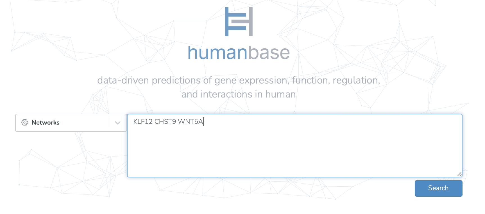
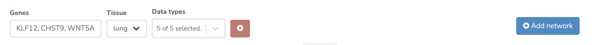
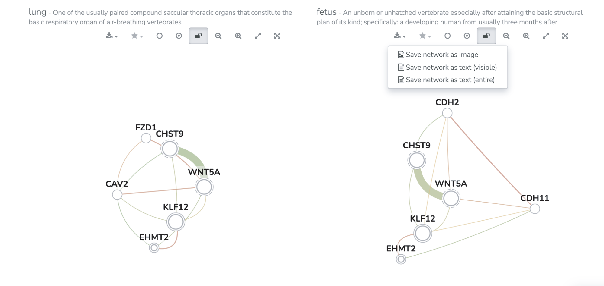

===========================
Comparing networks use case
===========================

This use case is drawn from Akat et al. 2022, Bronchopulmonary dysplasia and wnt pathway-associated single nucleotide polymorphisms

**Task: How do the relationships between my genes of interest differ between lung tissue and fetal tissue?**

* Input bronchopulmonary dysplasia-related genes of interest. Select “Search.”

* Select the first tissue type of interest (lung). Select “Add Network” and choose the second tissue type of interest (fetus).

* Adjust the maximum number of genes for both networks.

* Save the resulting networks.

Related Tools
-------------

* :doc:`/functional-networks` - Tissue-specific functional networks documentation
* :doc:`functional-enrichments` - Functional enrichments in networks use case
* :doc:`networks-use-case` - Networks use case
