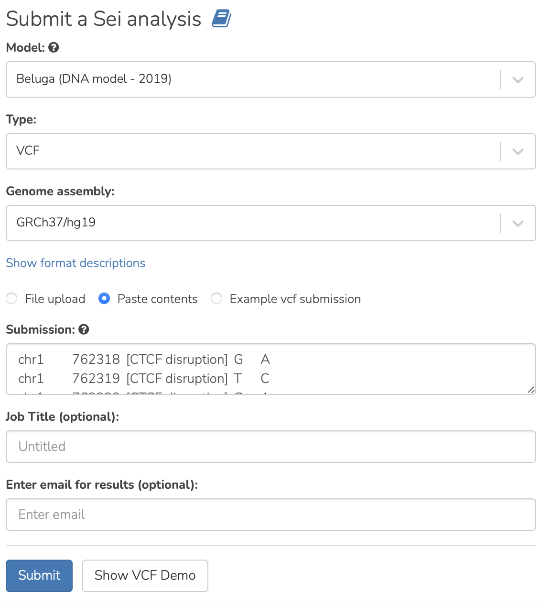
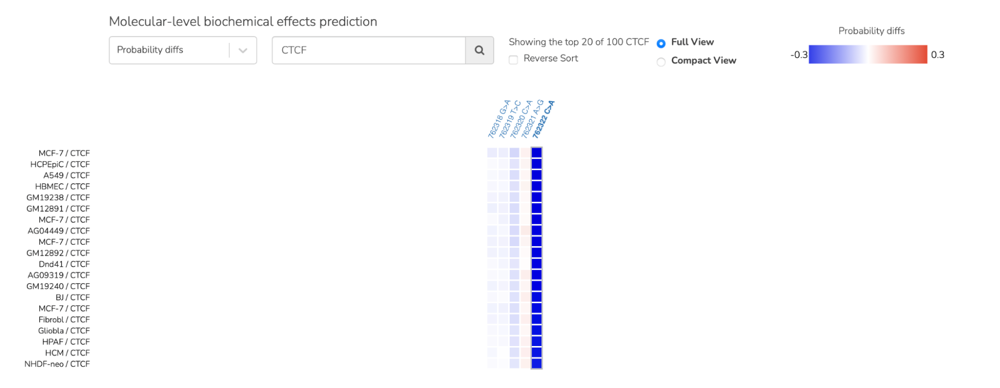
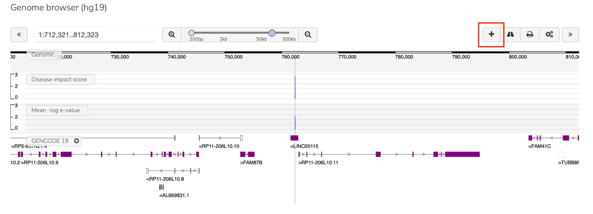
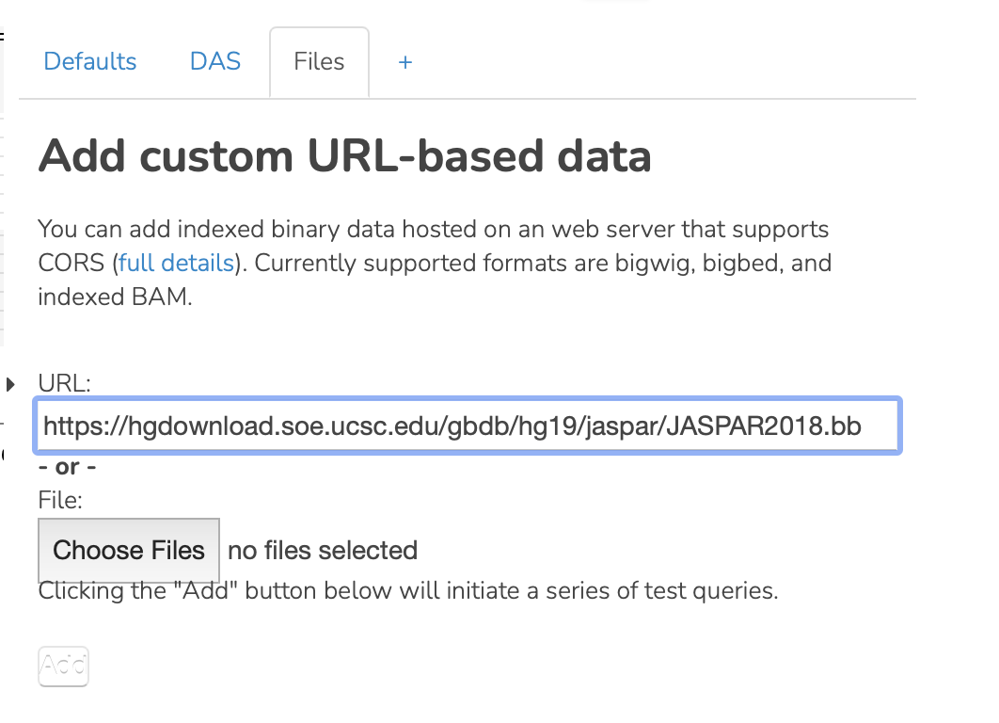
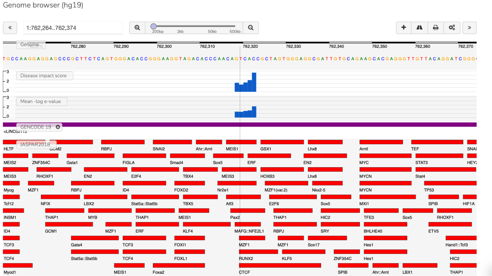
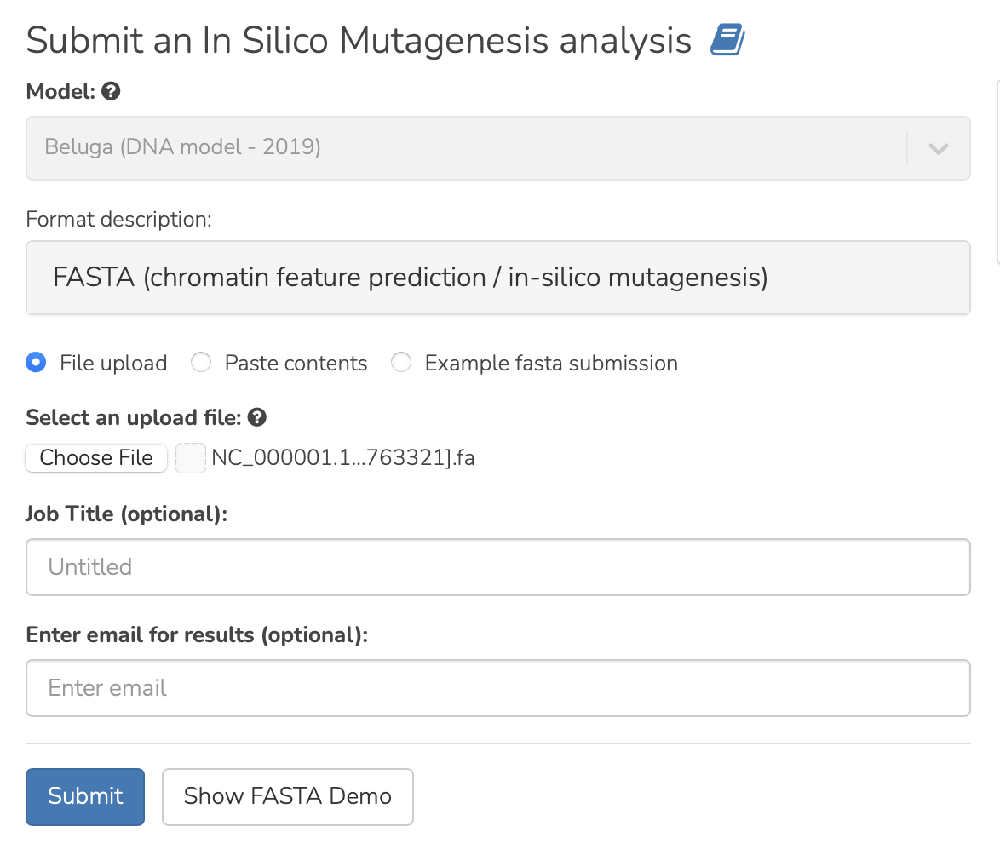
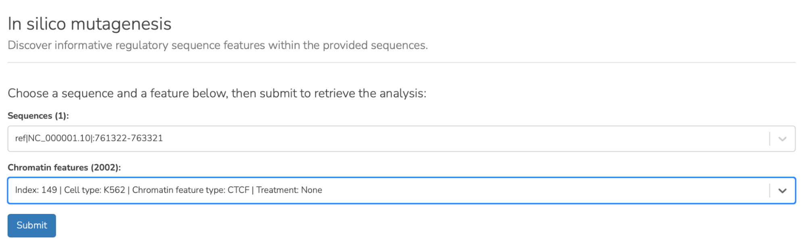
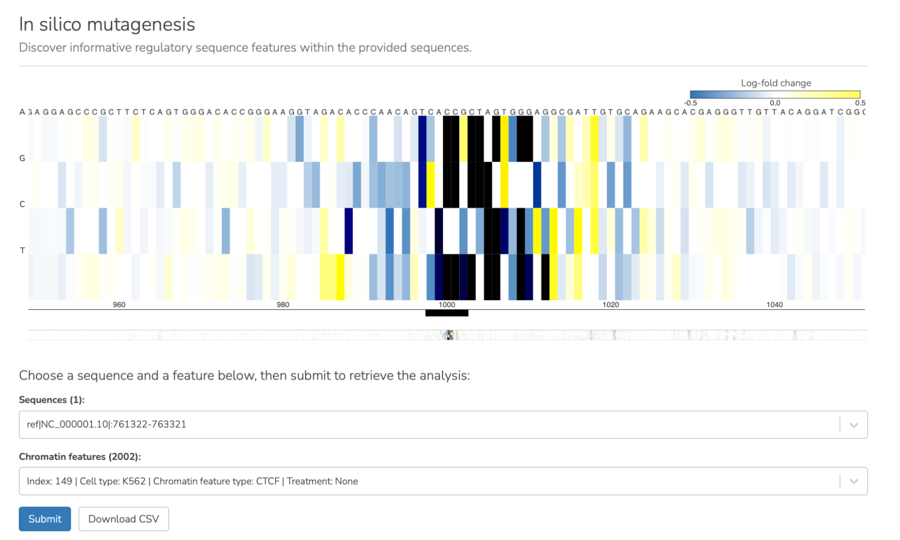

=======================
CTCF disruption example
=======================

**Task: Investigate the impact of variants at a site experimentally determined to bind CTCF.**

HumanBase sequence models can be used to probe how sequence relates to function. For example, given the experimental observation that CTCF binds in a ChipSeq assay to the region chr1:762285-762358 (hg19) (`insulatordb.uthsc.edu <http://insulatordb.uthsc.edu/>`_), a researcher can ask which positions and bases (A,C,G or T) are important for binding through querying the model with a set of variants.

The variants can be any possible set of variants. In item 1, we query a set of variants near the center of the CTCF binding region (could be from a screen, a set of variants observed in genome sequencing study, etc.). No more than 10,000 variants may be queried in a single submission to the webserver. In item 7, we query the model to predict the effect of every single possible mutation across the region with in silico mutagenesis.

**Step 1:** We select "Beluga" from the Analyses menu, select the "Paste contents" radio button, input the variant in VCF format, and select "Submit."

The VCF format is 5 columns of tab-separated data: chromosome, position, note, reference allele, alternative allele.

The VCF file for the variants that we query looks like this:

.. code-block:: text

   chr1        762318        [CTCF disruption]        G        A
   chr1        762319        [CTCF disruption]        T        C
   chr1        762320        [CTCF disruption]        C        A
   chr1        762321        [CTCF disruption]        A        G
   chr1        762322        [CTCF disruption]        C        A

**Step 2:** The result is presented in a probability difference heatmap where each block shows the difference in probability predicted for the reference allele binding the feature versus the alternative allele binding the feature. The results view shows that 762322 C>A variant is predicted to most strongly disrupt CTCF binding among the variants queried.

**Step 3:** The results view also displays a genome browser which shows the variants in their genomic context. Additional information can be added to the browser, like sequence motif information, ChIP-seq experimental data, enhancer or other regulatory feature information - as in the UCSC genome browser. To do this, select the + option to the top right of the genome browser (highlighted with red box the image below) and choose the "Files" tab. This allows adding genome tracks in bigBed, bigWig, or indexed BAM format. Some useful genome tracks suitable for loading into the interface can be found at the following directory: `https://hgdownload.soe.ucsc.edu/gbdb/hg19/ <https://hgdownload.soe.ucsc.edu/gbdb/hg19/>`_ (the files with extension .bb are bigBed files).

**Step 4:** We upload a track of motifs from the JASPAR database (`JASPAR2018.bb <https://hgdownload.soe.ucsc.edu/gbdb/hg19/jaspar/JASPAR2018.bb>`_) to investigate what motifs overlap the variant sites that we have queried.

**Step 5:** We then see a track of motif locations added to the genome browser. Zooming in we see that our variants of interest do indeed overlap a CTCF motif.

**Step 6:** To further explore the predicted impact of variants at this site on CTCF binding, we can use the in silico mutagenesis tool. We first use the NCBI genome browser tool for hg19 at `https://www.ncbi.nlm.nih.gov/gdv/browser/genome/?id=GCF_000001405.25 <https://www.ncbi.nlm.nih.gov/gdv/browser/genome/?id=GCF_000001405.25>`_ (selecting the download button to the top right over the genome browser) to download a FASTA file of a 2000 base pair region centered at the experimentally determined CTCF binding site from insulatordb (see :doc:`extracting-fasta`). The region covered by the FASTA file is chr1:761322-763321. We then go to the in silico mutagenesis tool, upload our FASTA file, and press submit.

**Step 7:** We then select the feature of interest (CTCF binding in K562 cells) and press submit.

**Step 8:** We see that variants in the center of the region we queried (in the experimentally defined CTCF region) are predicted to most strongly disrupt CTCF binding in K562 cells. Dark blue cells indicate that almost any base substitution leads to a strong decrease in probability of binding, however, substitution of a T on the 3' side of the motif to an A or G is predicted to increase binding (yellow). From this view, to see how other sequence features/TFs might be affected by the mutations, we can choose another chromatin feature from the pulldown menu and press submit to view the predicted impact of variants on that feature.

