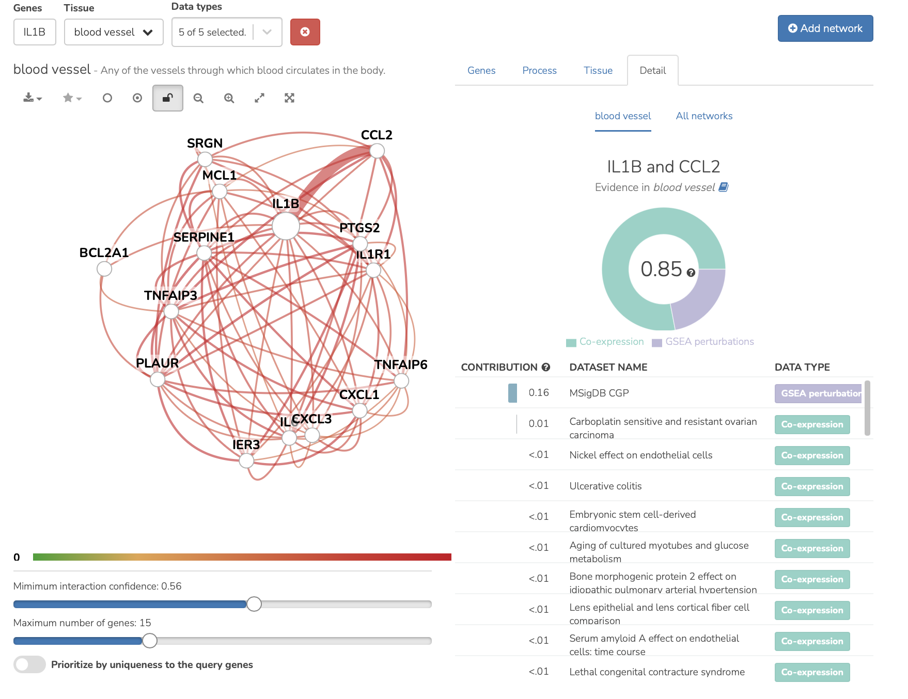

===========================
Edge contributions use case
===========================

**What underlying datasets most strongly support a predicted functional relationship?**

* Input IL1B in the search box

* Select the network of interest (for example, blood vessel) and the edge of interest (for example between IL1B and CCL2). The evidence supporting the edge will be dispayed to the right (here, the relationship between IL1B and CCL2 is supported primarily by co-expression and GSEA perturbation datasets).

