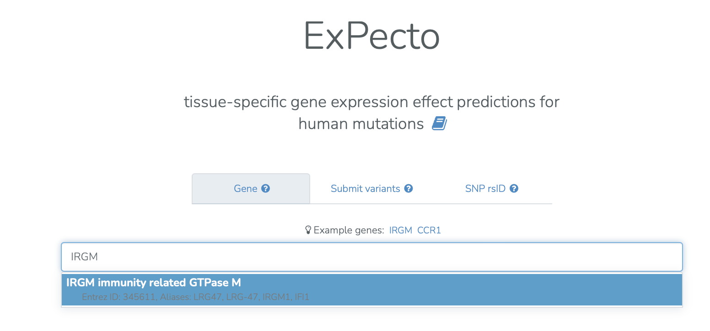
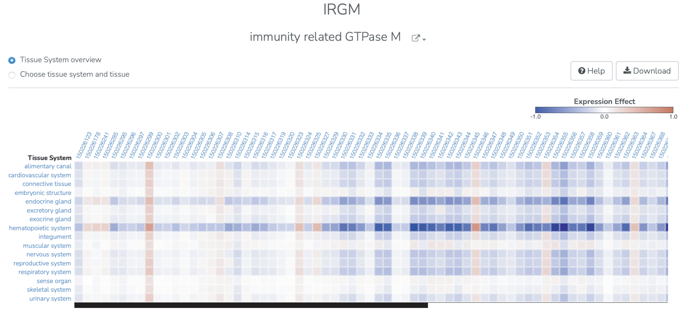
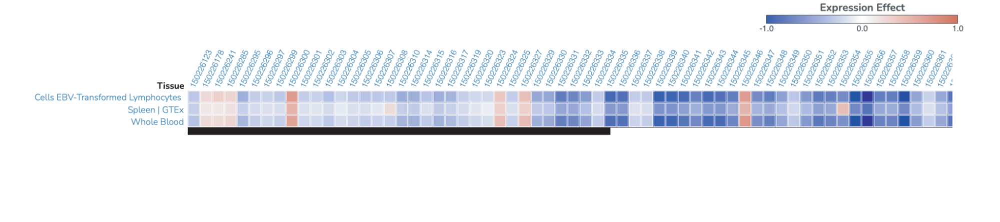
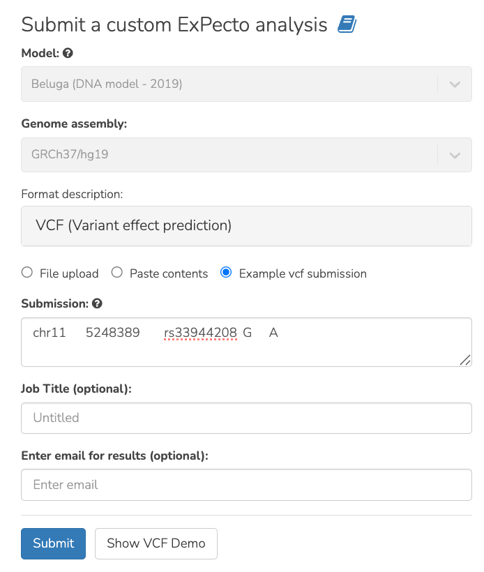
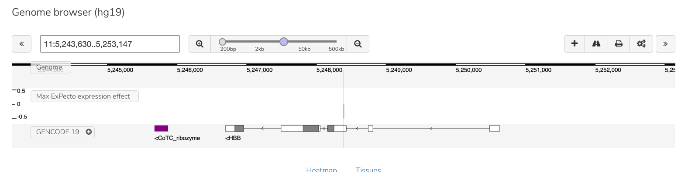
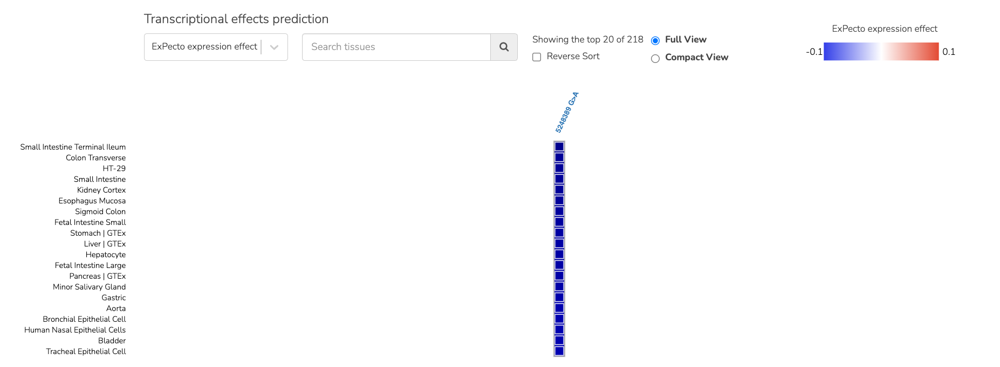

================
ExPecto use case
================

**Task: What is the impact of a noncoding variant on the tissue-specific expression of nearby genes?**

* Select the ExPecto analysis and input the query by gene name, VCF file, or SNP rsID. We first demonstrate a query by gene name.

* View predictions for the tissue-specific gene expression of the gene of interest. Selecting a tissue system in the overview view (for example, hematopoietic system) shows the expression impact in specific tissues within that tissue system. The expression effect is the log fold change between the expression level of the reference and alternate allele (see ExPecto documentation). The results can also be downloaded in tabular form using the “Download” button.

**Step 3:** We next demonstrate a VCF-formatted query. We query using VCF format the variant rs33944208 (chr11:5248389 G>A in hg19 coordinates). This variant is associated with beta-thalassemia with reduced expression of the HBB gene (Orkin et al. 1984 PMID: 6086605). Note that although a single variant is queried in this example, the interface supports simultaneously querying many (up to 10,000) variants.

**Step 4:** In the genome browser results view, we see that this variant is in the 5’ UTR of the HBB gene.

**Step 5:** ExPecto predicts that the variant downregulates the associated gene across cell types.

