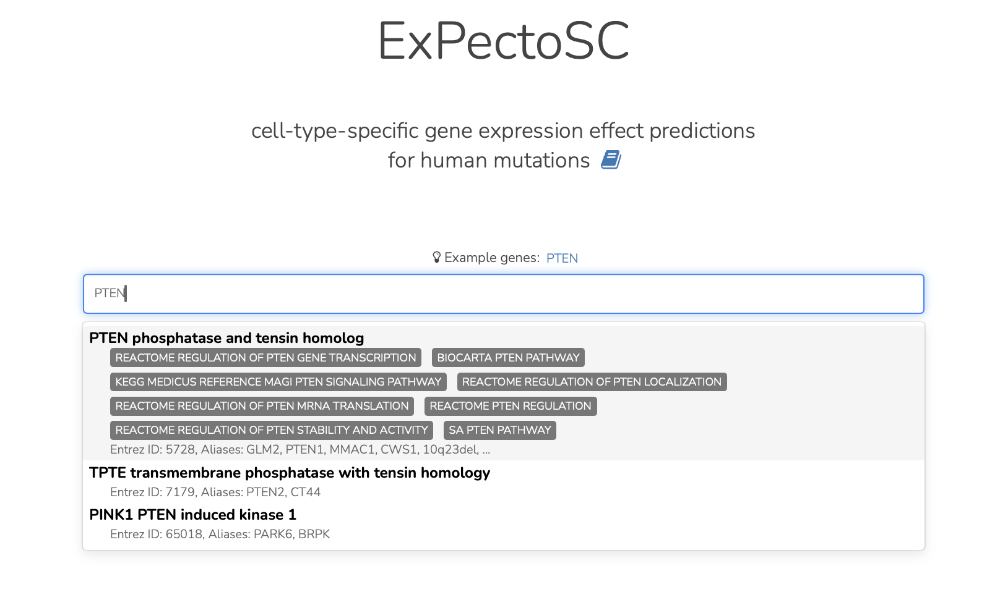
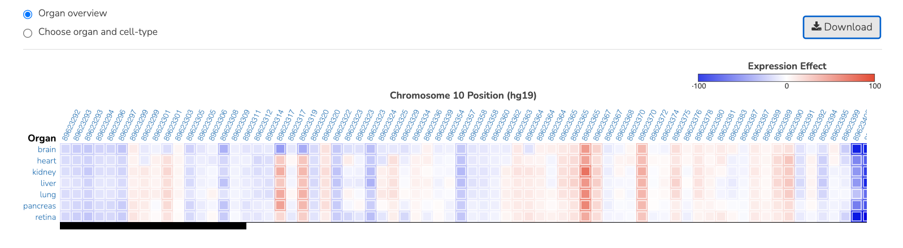
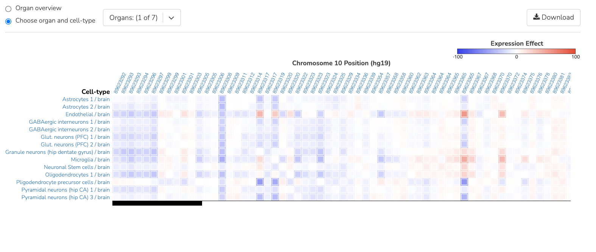

==================
ExPectoSC use case
==================

**Task: Which non-coding variants have a strong effect on the cell-type specific expression of a nearby gene?**

* Navigate to humanbase.io/expectosc or choose the “ExPectoSC” option from the main Analyses menu.Input a gene of interest (for example, PTEN).

* View noncoding variants with a strong effect on the expression of a nearby gene (summarized at the tissue level). The “Expression Effect” scores (described in more detail in the documentation) are the predictions of variant effects normalized to 1000 Genomes variants. A “Download” button allows downloading predictions as a tsv file.

* Select a tissue type (for example, brain) to view cell-type specific impacts of the noncoding variants on the expression of the corresponding gene. Cell-type specific variant effect predictions can also be downloaded as a table.

