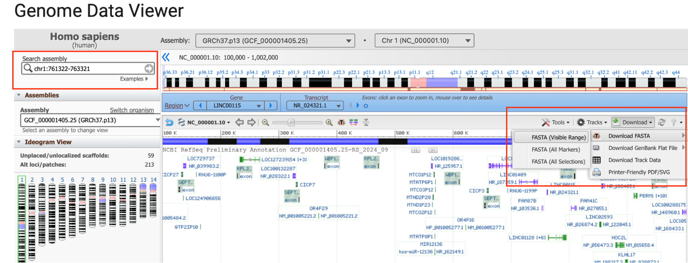

================================
Extracting a FASTA file tutorial
================================

**Task: Extract a FASTA file for a region of interest (for example, as input to the in silico mutagenesis tool).**

We will use an external tool, the NCBI Genome Data Viewer, for this task.

The NCBI Genome Data Viewer for hg19 can be accessed at the following link: https://www.ncbi.nlm.nih.gov/gdv/browser/genome/?id=GCF_000001405.25

Input the desired coordinates to download in the top left (red box). Once the correct genome region is displayed, select Download -> Download FASTA -> FASTA (Visible Range). This will download a FASTA file that can then be uploaded into HumanBase tools.

