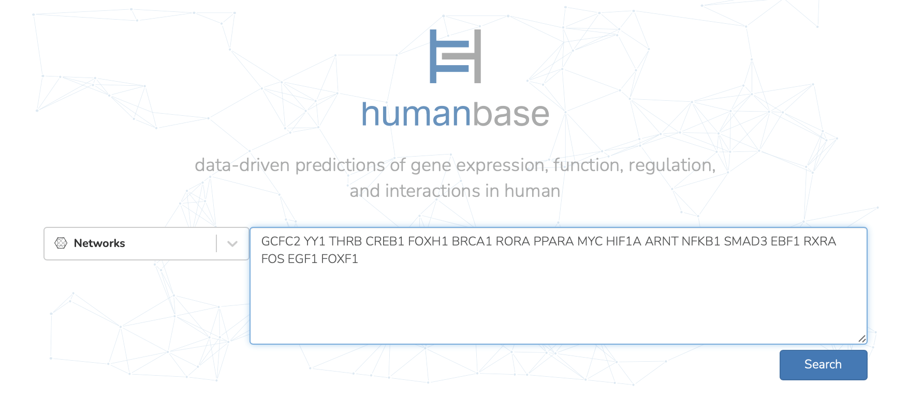
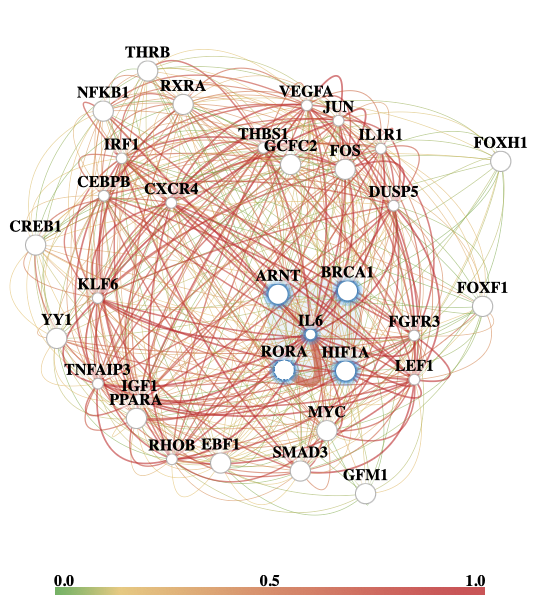
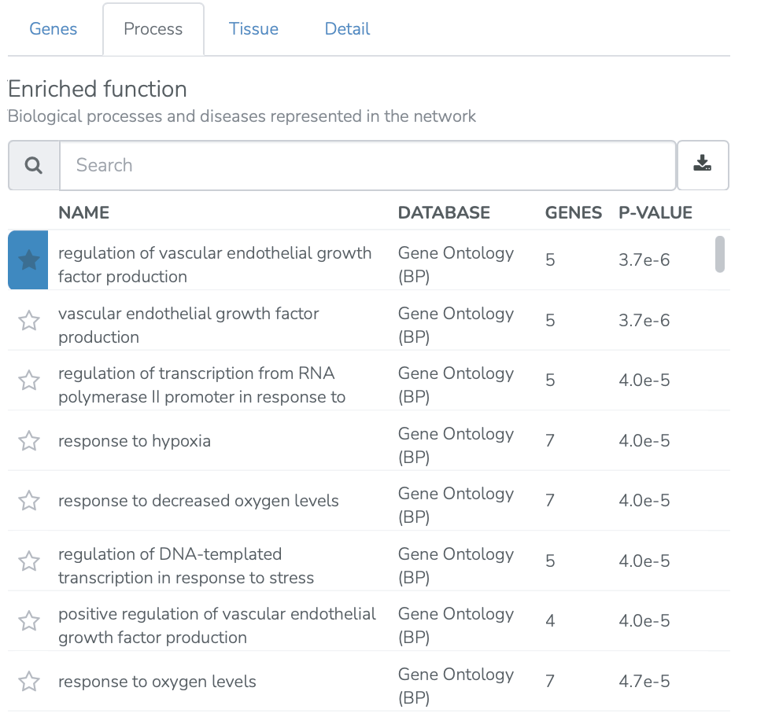

===========================================
Functional enrichments in networks use case
===========================================

This use case is drawn from De Roover et al. 2021, Hypoxia induces DOT1L in articular cartilage to protect against osteoarthritis.

**Task: What processes are enriched among genes functionally related to my genes of interest in cartilage tissue?**

* Input genes of interest (18 TFs identified as likely to regulate osteoarthritis-relevant gene DOT1L). Select “Search.”

* Select tissue type of interest (cartilage).

* View functional enrichments of the gene of interest and related genes in the cartilage network. Download the network and functional enrichments. The color of an edge in the functional network indicates the probability that the corresponding pair of genes is functionally related (the network edge weights are computed by Bayesian integration of the data compendium using the tissue-specific gold standard).

