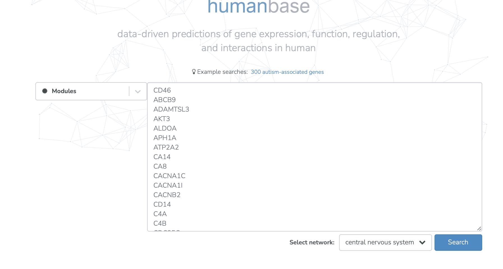
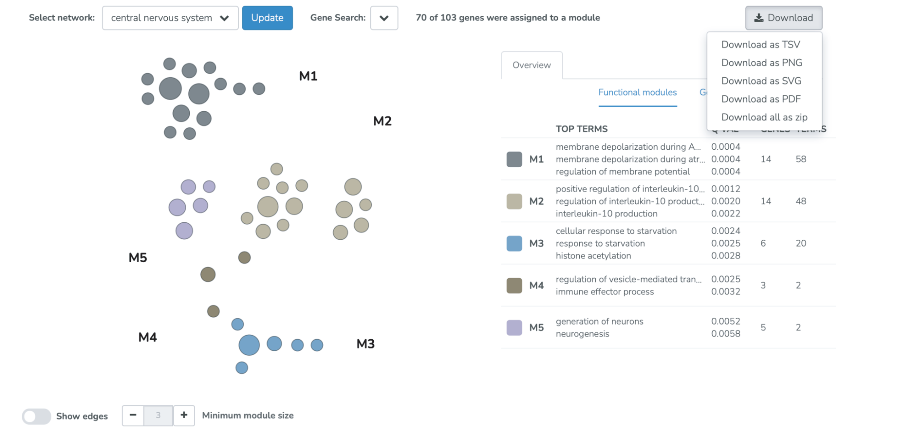

=====================================
Functional module clustering use case
=====================================

This use case is drawn from Bishop et al. 2022, Inflammation Subtypes and Translating

Inflammation-Related Genetic Findings in Schizophrenia and Related Psychoses: A Perspective on Pathways for Treatment Stratification and Novel Therapies

**Task: How can I partition my list of genes of interest into modules, and what are the functional enrichments in these modules?**

* Select the “Modules” analysis. Input genes of interest (103 druggable schizophrenia-related genes). Select the desired network (central nervous system). Select “Search.”

* View the modules identified by data-driven community clustering of the gene set of interest in the selected network. The functional enrichments of the detected modules can also be viewed and the minimum module size cutoff  can be adjusted. The resulting module clustering and enrichment table can be downloaded in multiple formats.

Related Tools
-------------

* :doc:`/modules` - Main functional module detection documentation
* :doc:`/functional-networks` - Tissue-specific functional networks documentation
* :doc:`functional-enrichments` - Functional enrichments in networks use case
* :doc:`comparing-networks` - Comparing networks use case
