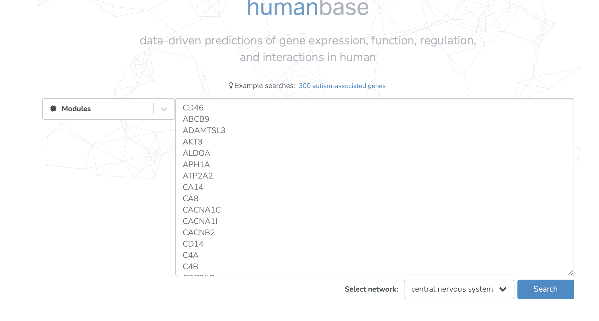
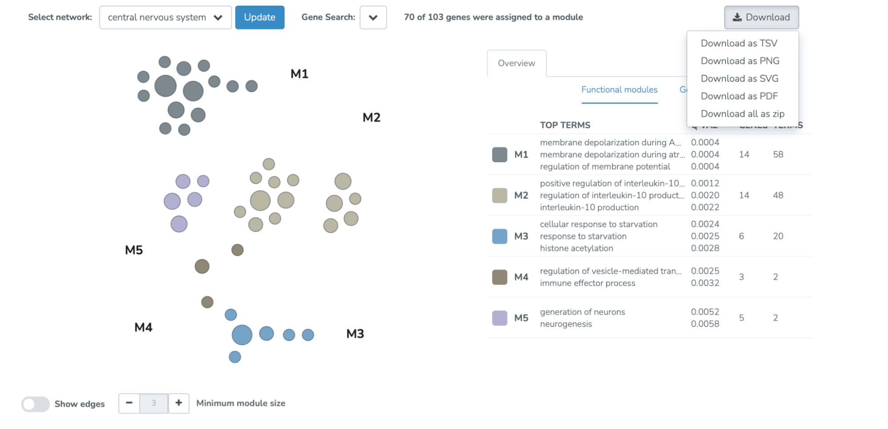
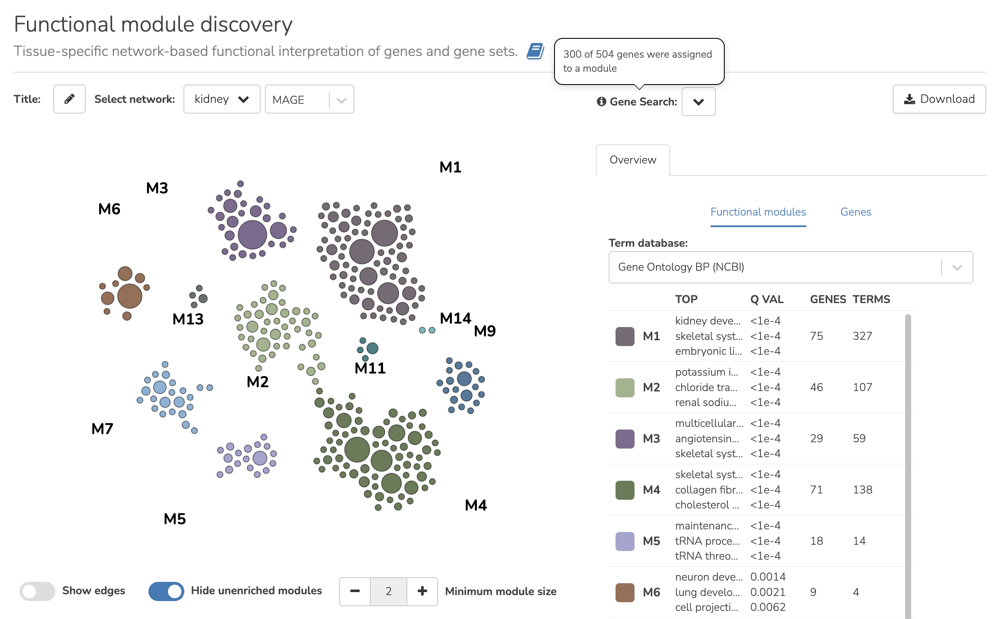
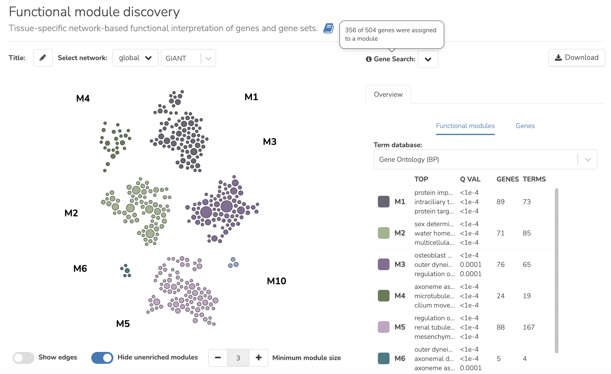

======================================
Functional module clustering use cases
======================================

This use case is drawn from Bishop et al. 2022, Inflammation Subtypes and Translating Inflammation-Related Genetic Findings in Schizophrenia and Related Psychoses: A Perspective on Pathways for Treatment Stratification and Novel Therapies

**Task: How can I partition my list of genes of interest into modules, and what are the functional enrichments in these modules?**

* Select the “Modules” analysis. Input genes of interest (103 druggable schizophrenia-related genes). Select the desired network (central nervous system). Select “Search.”

* View the modules identified by data-driven community clustering of the gene set of interest in the selected network. The functional enrichments of the detected modules can also be viewed and the minimum module size cutoff  can be adjusted. The resulting module clustering and enrichment table can be downloaded in multiple formats.

The second use case is from a Biongenetic commercial renal panel to screen for prevalent hereditary kidney disorders.

**Task: How can I determine specific processes and phenotypes that these disease genes participate in, and how do these genes differ in function in the global vs. relevant tissue network?**

* Select the “Modules” analysis. Input genes of interest (504 genes). Select the desired network (kidney). Select “Search.”

* Select the “Modules” analysis. Input genes of interest (504 genes). Select the desired network (global). Select “Search.”

* The resulting modules detected in the nephron network are more kidney-specific than the global network, even though there are more genes assigned to a module in the global network. The global network captures general modules spanning developmental biology and organ morphogenesis, while the kidney network covers kidney physiology, system-level regulation, and kidney development.

