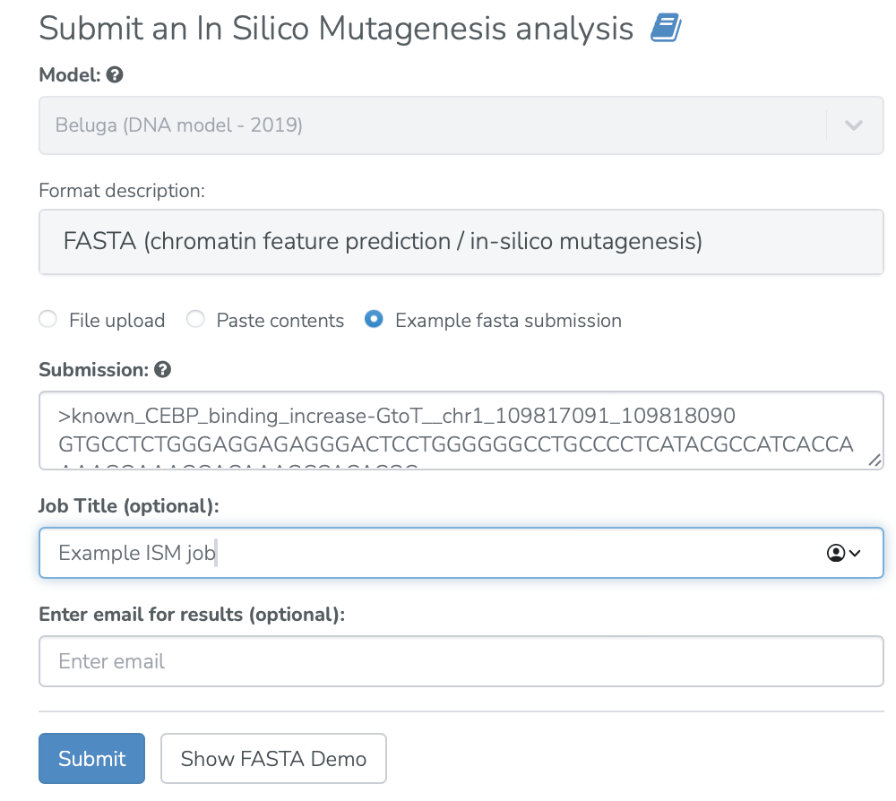
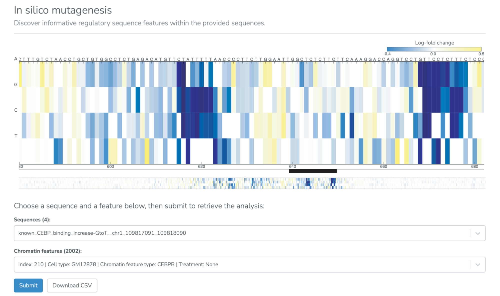

==============================
In Silico Mutagenesis use case
==============================

**Task: Which base changes in a sequence of interest are likely to have a large impact on a specific chromatin feature?**

* Select “In silico mutagenesis” from the “Analyses” menu, input a sequence of interest, and select “Submit.”

* Select a chromatin feature and view the predicted impact of all possible base changes in the input sequence on the selected chromatin feature. The perturbed feature that is displayed is selected from the "Chromatin features" dropdown menu. See the In Silico Mutagenesis documentation or the `DeepSEA paper <https://www.nature.com/articles/nmeth.3547>`_ for the interpretation of the log fold change scores. The in silico mutagenesis predictions can also be downloaded as a csv file.

