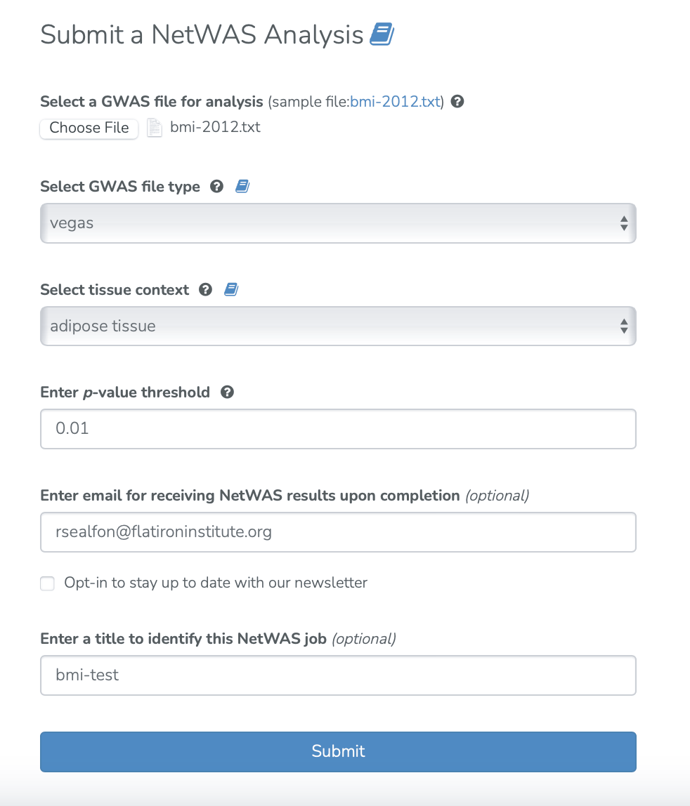
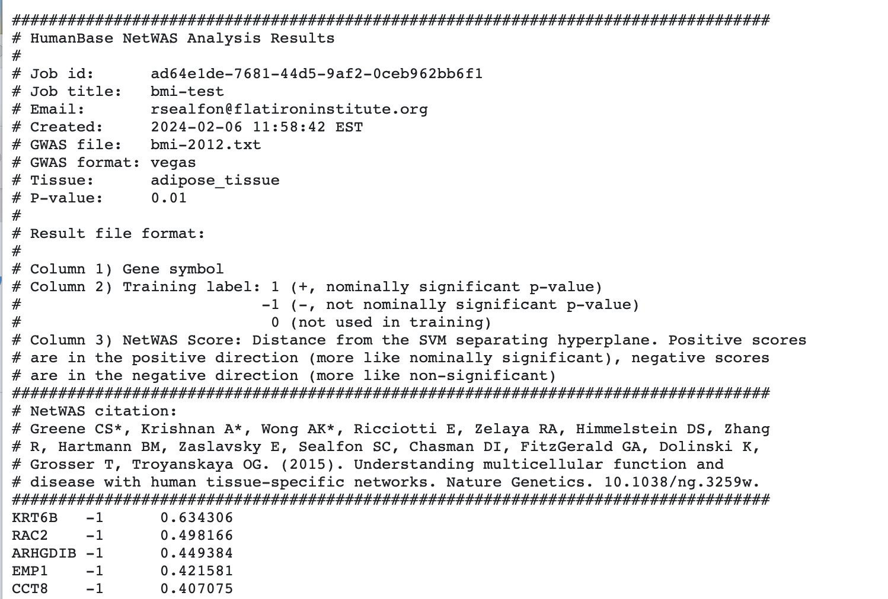

===============
NetWAS use case
===============

**Task: Which nominally significant hits in a GWAS of BMI are likely to be causal?**

* Select “GWAS re-prioritization (NetWAS)” analysis. Prepare a per-gene P-value summary file for the GWAS of interest (using the VEGAS framework is recommended for this). Upload the per-gene P-value summary file, select the GWAS file type, tissue context, and P-value threshold. Enter an email for receiving results and job title. Select “Submit.”

* NetWAS analysis results are provided by email. Results are ranked by an SVM classifier based on the similarity of the network connectivity of each gene to nominally significant training examples.

