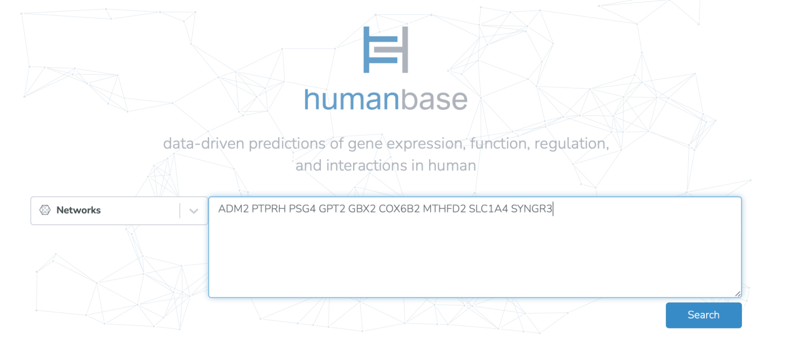
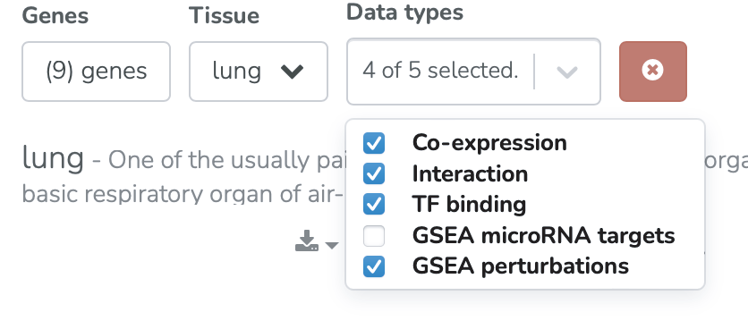
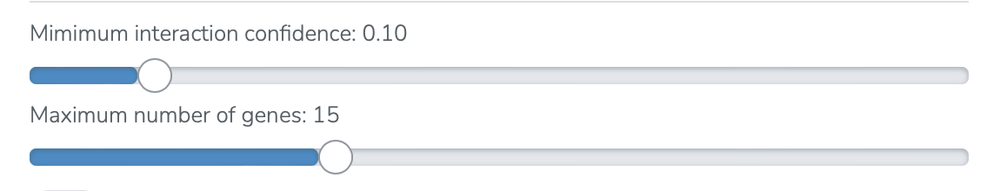
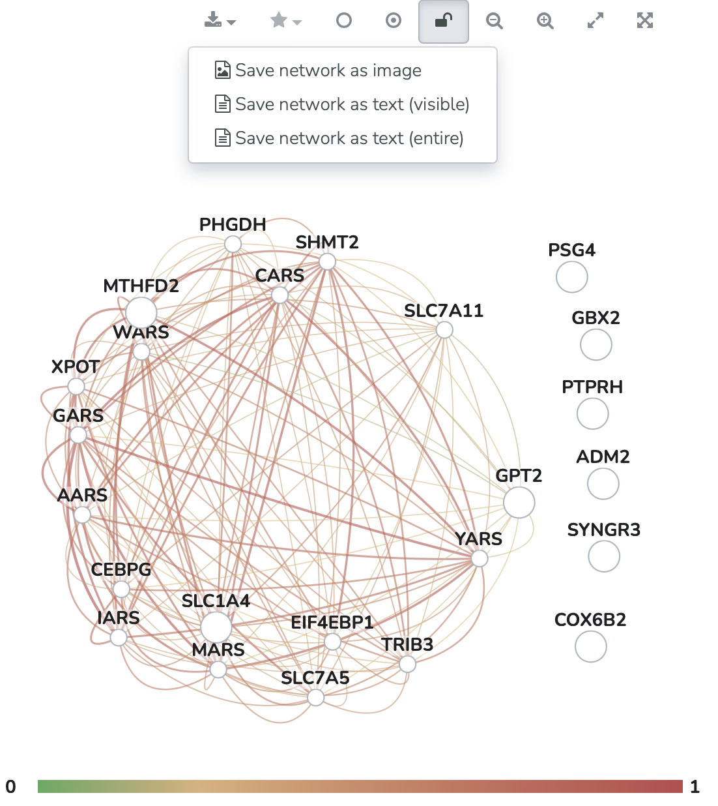

=================
Networks use case
=================

Drawn from Cury et al. 2023, Transcriptional profiles and common genes link lung cancer with the development and severity of COVID-19.

**Task: What genes are functionally related to my gene(s) of interest in lung tissue?**

* Input genes of interest (9 genes identified as upregulated in both SARS-CoV-2 infected lung cell lines and lung cancer samples). Select “Search.”

* Select desired tissue and data types for the network.

* Select the desired interaction confidence threshold and maximum number of genes.

* Export the network as an image or as text.

Related Tools
-------------

* :doc:`/functional-networks` - Tissue-specific functional networks documentation
* :doc:`/tissue-networks` - Tissue-specific networks documentation
* :doc:`functional-enrichments` - Functional enrichments in networks use case
* :doc:`comparing-networks` - Comparing networks use case
* :doc:`functional-module-clustering` - Functional module clustering use case
