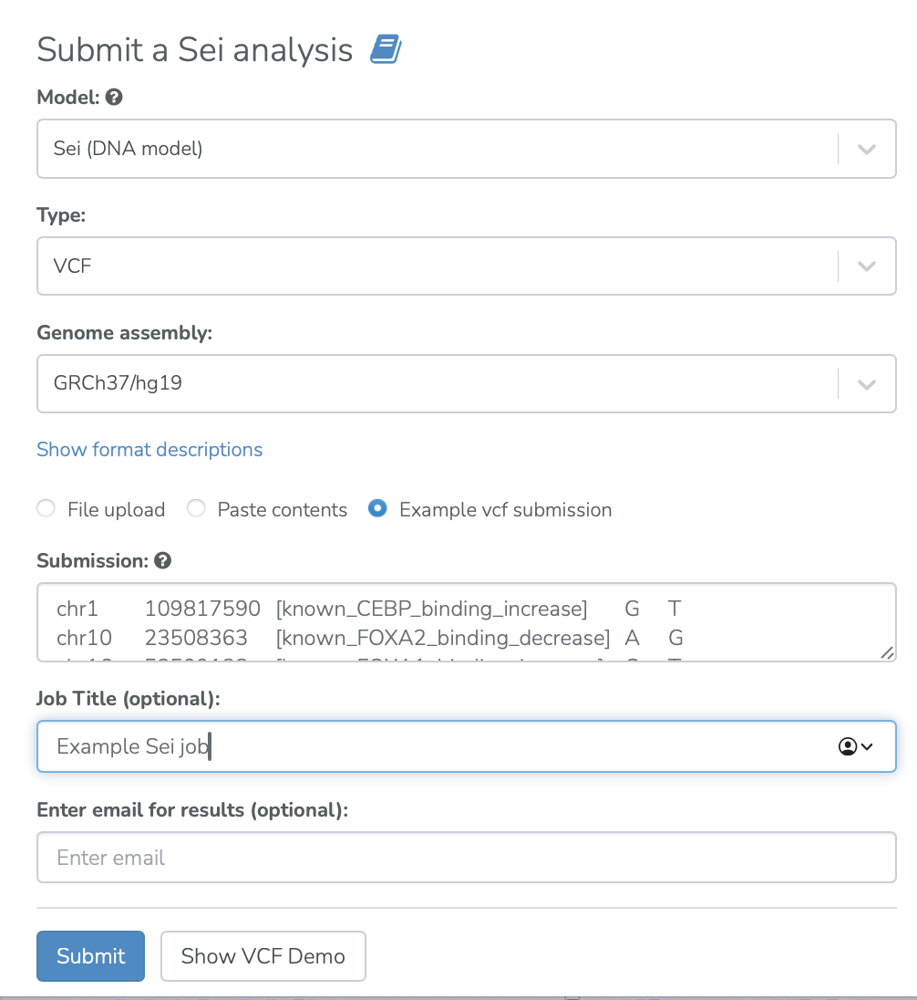
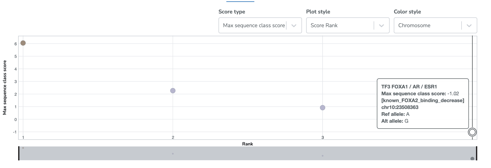
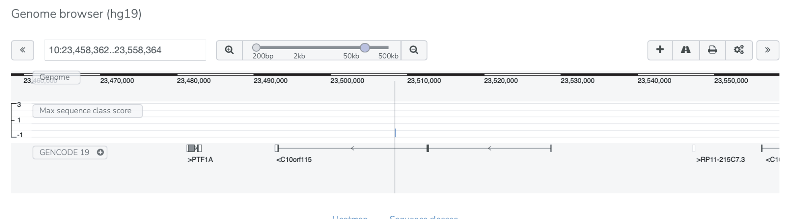
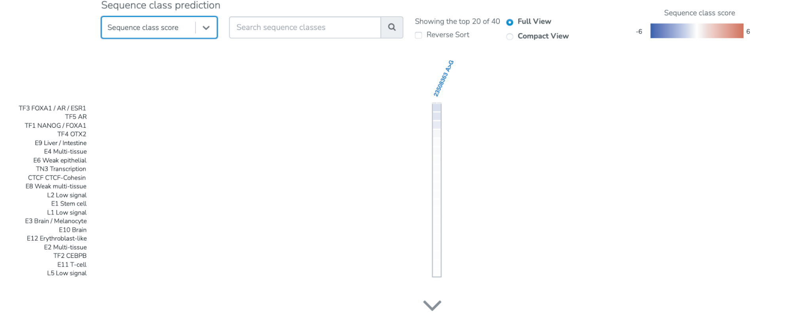

============
Sei use case
============

**Task: What is the impact of a non-coding variant on the regulatory activity of a sequence?**

* Select Sei from the analyses menu. Input noncoding variants of interest and submit the job.

* View visualizations of the impact of the input variants on the regulatory class of the sequence. For example, the A to G mutation at position 23508363 on chromosome 10 decreases the sequence class score of the "TF3 FOXA1/AR/ESR" regulatory class. The method for computing the Sei sequence class scores can be found in the Methods/Sequence class scores section of `the Sei paper <https://www.nature.com/articles/s41588-022-01102-2>`_. A table of the results can also be viewed and downloaded.

* Each variant can also be viewed in its genomic context in a genome browser.

* Heatmap visualizations of the sequence class score are also provided. By selecting the down arrow next to "Sequence class score" and choosing "Probability diffs", the user can alternately view a probability difference heatmap of the molecular-level biochemical effects of the variant, where each block shows the difference in probability predicted for the reference allele having the epigenetic feature versus the alternative allele having the epigenetic feature.

