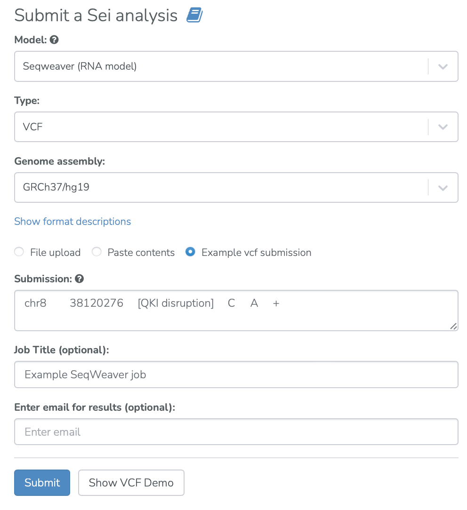

==================
Seqweaver use case
==================

Use case drawn from Park et al. 2021, Genome-wide landscape of RNA-binding protein target site dysregulation reveals a major impact on psychiatric disorder risk.

**Task: What is the post-transcriptional impact of a noncoding variant on binding of RNA binding proteins?**

* Select the “SeqWeaver” analysis from the main analyses menu. Input noncoding variants of interest and submit job.

* View visualizations of the impact of the input variants on the RNA binding protein (RBP) affinity of the sequence. Here, the disease impact score of the query variant is visualized. The disease impact score is calculated by training a logistic regression model that prioritizes likely disease-associated mutations on the basis of the predicted post-transcriptional regulatory effects of these mutations (See `Zhou et. al, 2019 <https://www.nature.com/articles/s41588-019-0420-0>`_ and the Seqweaver documentation). Tabular representations of all predictions can also be viewed and downloaded.

* The variant can be viewed in its genomic context on a genome browser. This variant lies in the DDHD2 gene.

* The heatmap view shows that the variant is predicted to disrupt binding of the schizophrenia-associated RNA binding protein QKI. The z-score is a scaled score where the feature diff score (𝑝𝑎𝑙𝑡 − 𝑝𝑟𝑒𝑓) is divided by the root mean square of the feature diff score across gnomAD variants (see Seqweaver documentation).

